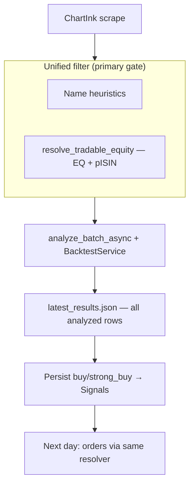

# Screener equity filtering and tradability resolver

**Status:** Implemented (2026-06-08)  
**Last updated:** 2026-06-08  
**Related:** [ARCHITECTURE.md](../ARCHITECTURE.md) (analysis flow, T2T filtering)

---

## Overview

ChartInk screener output (`daily-rsi-6602`) mixes **single-stock equities**, **commodity ETFs**, and **index/basket products**. The rebound strategy targets NSE **`-EQ` equities** only. Two gaps cause bad signals and wasted analysis:

1. **Upstream screener filters** drop obvious ETFs/indices but miss commodity silver ETFs and CPSE baskets.
2. **Bare-base scrip resolution** (`get_instrument("GALLANTT")`) uses **first-wins** map order and can resolve to `-BL` even when `-EQ` exists — falsely blocking buy signals at persist while orders later use explicit `-EQ` resolution.

This document defines a **filter-first pipeline**: a **unified pre-analysis tradability filter** (name heuristics + scrip resolver), then analysis + backtest, then signals. The same resolver is retained at **order placement** as a defense-in-depth check.

---

## Purpose

| Audience | Goal |
|----------|------|
| Developers | Implement consistent allow/deny rules and EQ-first resolution |
| Operators | Understand why commodity ETFs or false T2T skips appeared on a given run |

**Out of scope:** Changing ChartInk screen criteria, ML model training, or broker order types.

---

## Background — 2026-06-08 analysis run

**Screener:** `daily-rsi-6602` (ChartInk), admin-only analysis (user 1).

| Stage | Count | Notes |
|-------|-------|-------|
| Raw scrape | 20 | See symbol table below |
| After current filters | 18 | `NIFTYCPSE`, `CPSEETF` removed — **name rules only** |
| Analyzed | 18 | ETFs and T2T-only names should not reach here after fix |
| Buy verdicts in JSON | 5 | Includes `SILVERAG`, `AXISILVER`, `STAR`, `GALLANTT`, `RAMRAT` |
| Persisted (buggy) | 2 | `SILVERAG`, `AXISILVER` inserted |
| T2T-filtered at persist (buggy) | 3 | `STAR`, `GALLANTT`, `RAMRAT` (false positive on `GALLANTT`) |
| Expired | 1 | `AVANTIFEED` |

**After this design:** unified pre-filter → ~14 analyze → 3 buy signals persist (`STAR`, `GALLANTT`, `RAMRAT`).

Morning live buys used a **stale Jun 5** `AVANTIFEED` signal, not this afternoon run.

---

## Current behavior (code)

### Layer A — Screener heuristics

**File:** `src/infrastructure/web_scraping/screener_symbol_filters.py`

| Rule type | Patterns |
|-----------|----------|
| Suffix | `BEES` |
| Contains | `ETF`, `NIFTY`, `BANKNIFTY`, `FINNIFTY`, `MIDCPNIFTY`, `BHARATBOND` |
| Prefix | `BHARATBOND` |

Does **not** block `SILVERAG`, `AXISILVER`, or `CNXPSE`.

### Layer B — Tradability re-check at persist

**File:** `src/application/services/individual_service_manager.py` — `_is_non_tradable_equity()`

- Thin defense-in-depth via `resolve_tradable_equity()` (EQ-first, `pISIN` `INF`/`INE`).
- Denies ETF/MF units, T2T-only listings, missing ISIN, and symbols with no `-EQ` row.
- Summary counter: `tradability_filtered` (log: non-tradable symbols at persist).

### Layer C — Order symbol resolution

**File:** `modules/kotak_neo_auto_trader/auto_trade_engine.py` — `_resolve_broker_symbol()`

- **EQ-only**; rejects T2T suffixes explicitly.
- Used at order placement (correct path for `GALLANTT-EQ`).

### Root cause — scrip map first-wins

**File:** `modules/kotak_neo_auto_trader/scrip_master.py` — `_build_symbol_map()`

```text
if base_symbol not in self.symbol_map:
    self.symbol_map[base_symbol] = ...
```

Iteration order determines which segment (`-BL` vs `-EQ`) wins for bare `GALLANTT`. Persist uses bare base; orders use EQ-first logic — **inconsistent**.

---

## Proposed design

### Target pipeline

```text
Filter first  →  Analysis + backtest  →  Signals
```



| Stage | When | Responsibility |
|-------|------|----------------|
| **Unified pre-filter** | Before analysis (`get_stocks()`) | Drop non-tradable symbols; only survivors get yfinance + backtest |
| **Analysis + backtest** | `trade_agent.py --backtest` | Unchanged; runs on filtered list only |
| **Signals persist** | `_persist_analysis_results()` | `buy` / `strong_buy` + dedup; optional thin re-check (see below) |
| **Orders** | `_resolve_broker_symbol()` | Same resolver — defense in depth on money-moving path |

Scrape size **varies per run**; counts in examples are illustrative, not fixed pipeline invariants.

---

### Unified pre-analysis filter (primary)

**New entry point:** `filter_tradable_screener_symbols()` (or extend `parse_and_filter_screener_csv()`).

**Wired from:**

| Caller | Today | After |
|--------|-------|-------|
| `trade_agent.get_stocks()` | Name heuristics only | Unified filter → `.NS` suffix |
| `ChartInkScraper.get_stocks()` | Name heuristics only | Same unified filter |

**Scrip master:** load from `data/scrip_master/` cache only (no broker auth) — same pattern as persist re-check.

#### Step A — Name heuristics (fast, first pass)

**File:** `screener_symbol_filters.py` — extend existing rules.

| Rule | Examples |
|------|----------|
| Existing | `ETF`, `NIFTY*`, `BEES`, `BHARATBOND` |
| Blocklist | `SILVERAG`, `AXISILVER`, `MOSILVER`, `ESILVER`, … |
| Substrings | `SILVER`, `CPSE`, `GOLD` (tune if false positives) |

#### Step B — `resolve_tradable_equity(base)` (authoritative)

**New shared helper** (suggested location: `modules/kotak_neo_auto_trader/scrip_master.py` or `src/infrastructure/brokers/`):

**Inputs:** bare base symbol (e.g. `GALLANTT`), exchange (default `NSE`), scrip master instance.

**Outputs:**

| Result | Meaning |
|--------|---------|
| `ResolvedEquity(symbol="GALLANTT-EQ", ...)` | Tradable company equity |
| `Denied(reason=...)` | No EQ, ETF/MF unit, T2T-only, or not in master |

**Rules (EQ-first):**

1. Prefer `base-EQ` if present in scrip master.
2. If only `-BE`/`-BL`/`-BZ` → deny (`reason=t2t_only`).
3. If `pISIN` starts with **`INF`** → deny (`reason=mf_etf_unit`). See [ETF identification](#etf-identification-beyond-symbol-heuristics).
4. If `pISIN` starts with **`INE`** → allow through to analysis.
5. Never use bare-base first-wins lookup for tradability decisions.

**Logging:**

```text
Skipping non-tradable screener symbol: SILVERAG (reason=mf_etf_unit)
Skipping non-tradable screener symbol: SHYAMTEL (reason=t2t_only)
```

**Tests:** `test_screener_symbol_filters.py` (names) + new resolver unit tests with fixture scrip JSON.

**Optional optimization:** on scrip refresh, precompute `etf_bases` from `INF` rows for O(1) deny.

---

### Analysis + backtest (unchanged scope)

After unified filter:

```text
trade_agent.py --backtest
  → AsyncAnalysisService.analyze_batch_async(survivors)
  → BacktestService.add_backtest_scores_to_results
  → _process_results (Telegram / logging)
  → latest_results.json (all rows — audit trail)
```

Non-tradable symbols **never** enter this stage.

---

### Signals persist (simplified)

**File:** `individual_service_manager._persist_analysis_results()`

| Step | Behavior |
|------|----------|
| Load JSON | All analyzed rows |
| Verdict gate | `buy` / `strong_buy` only (unchanged) |
| Tradability | **Optional thin re-check** via same resolver; log if mismatch (should not happen) |
| Done | `_is_t2t_segment()` removed; persist uses `_is_non_tradable_equity()` only |
| Dedup / expiry | Unchanged (`AnalysisDeduplicationService`) |
| Trading hours | Unchanged (`should_update_signals()` 9–16 block) |

Persist no longer needs to be the **primary** ETF/T2T gate; pre-filter already enforced tradability.

---

### Orders (defense in depth)

**File:** `auto_trade_engine._resolve_broker_symbol()`

Refactor to call the same `resolve_tradable_equity()` helper. Raise on deny at order placement even if a symbol somehow reached the DB.

**Scrip map (optional hardening):** when storing base keys, prefer `-EQ` over other suffixes if both exist.

---

## ETF identification (beyond symbol heuristics)

Symbol substring rules (`ETF`, `SILVER`, `BEES`) are fast but incomplete: commodity tickers like `SILVERAG` and factor ETFs like `HDFCVALUE` / `MNC` do not match obvious patterns. The **`pISIN` field in the Kotak scrip master** already provides a reliable ETF vs equity split — no extra downloads or family taxonomy are required.

### Comparison of approaches

| Method | Source | Detects ETF? | Extra infra |
|--------|--------|--------------|-------------|
| Symbol heuristics | ChartInk token | Partial | None |
| **`pISIN` prefix** | Kotak scrip master | **Yes (reliable)** | None (already cached) |
| yfinance `quoteType` | Yahoo | **No** — returns `EQUITY` for NSE ETFs | Already used elsewhere |
| Bhavcopy `SctySrs` | NSE EOD | **No** — ETFs trade as `EQ` series | Already used |
| Scrip `pGroup` / `pInstType` | Kotak scrip master | **No** — same `EQ` / `CASH` for stocks and ETFs | None |

Verified on **2026-06-08** NSE scrip master (`data/scrip_master/scrip_master_NSE_20260608.json`):

| Field | Single-stock equity | ETF (listed as `-EQ`) |
|-------|---------------------|------------------------|
| `pGroup` | `EQ` | `EQ` |
| `pSegment` | `CASH` | `CASH` |
| `pInstType` | *(empty)* | *(empty)* |
| `pAmcCode` | *(empty in dump)* | *(empty in dump)* |
| **`pISIN`** | **`INE…`** (e.g. `INE297H01019` GALLANTT) | **`INF…`** (e.g. `INF769K01KG6` SILVERAG) |

Counts on that snapshot: **~2,125** `-EQ` listings with `INE…`, **~326** with `INF…`.

### Recommended: ISIN prefix in resolver (primary)

India ISIN allocation (simplified for NSE cash listings):

| Prefix | Meaning | Rebound strategy |
|--------|---------|------------------|
| **`INE`** | Company equity shares | Allow (if `-EQ` exists, not T2T-only) |
| **`INF`** | Mutual fund / ETF units | **Deny** |

Examples:

| Symbol | `pISIN` | Classification |
|--------|---------|----------------|
| GALLANTT | `INE297H01019` | Equity |
| RELIANCE | `INE002A01018` | Equity |
| SILVERAG | `INF769K01KG6` | ETF |
| AXISILVER | `INF846K011K1` | ETF |
| GOLDBEES | `INF204KB17I5` | ETF |
| NIFTYBEES | `INF204KB14I2` | ETF |
| HDFCVALUE | `INF…` | ETF (no `ETF` in symbol) |

**False-positive risk:** very low. Names like `GOLDIAM`, `SKYGOLD` remain **`INE`** and are correctly treated as equities.

**Implementation sketch:**

```python
def is_company_equity_isin(isin: str | None) -> bool:
    return (isin or "").strip().upper().startswith("INE")

def is_mf_or_etf_isin(isin: str | None) -> bool:
    return (isin or "").strip().upper().startswith("INF")
```

Read `pISIN` from the resolved `base-EQ` instrument row in scrip master — not from the bare ChartInk token.

### Resolver decision tree (used in pre-filter and orders)

```text
Screener symbol
    → name heuristics (fast reject)
    → resolve base-EQ in scrip master (never bare-base first-wins)
    → if no EQ row → deny (reason=no_eq_listing)
    → if pISIN.startswith("INF") → deny (reason=mf_etf_unit)
    → if only BE/BL/BZ available → deny (reason=t2t_only)
    → if pISIN.startswith("INE") → allow → analysis + backtest → signals
```

Name heuristics skip obvious noise; **ISIN in the resolver** catches ETFs without keyword-friendly tickers (`SILVERAG`, `HDFCVALUE`, future listings).

---

## Symbol classification — 2026-06-08 scrape (20 symbols)

Raw ChartInk list:

```text
NIFTYCPSE, CPSEETF, CNXPSE, SHYAMTEL, GABRIEL, UNIVPHOTO, JINDALSTEL, UEL,
ESABINDIA, GUJALKALI, STAR, AVANTIFEED, HINDCOPPER, GALLANTT, RAMRAT,
GRAPHITE, APEX, AARTIIND, AXISILVER, SILVERAG
```

| Symbol | `-EQ` / `pISIN` | Verdict (8 Jun) | Current (analyze?) | Unified pre-filter |
|--------|-----------------|-----------------|--------------------|--------------------|
| NIFTYCPSE | No | — | No | **DENY** (name) |
| CPSEETF | ETF | — | No | **DENY** (name) |
| CNXPSE | No | `no_data` | Yes (wasted) | **DENY** (name / no EQ) |
| SHYAMTEL | `-BE` only | — | Yes (wasted) | **DENY** (t2t_only) |
| GABRIEL | `INE`, EQ | watch | Yes | **ALLOW** → analyze |
| UNIVPHOTO | `-BE` only | — | Yes (wasted) | **DENY** (t2t_only) |
| JINDALSTEL | `INE`, EQ | watch | Yes | **ALLOW** → analyze |
| UEL | `INE`, EQ | watch | Yes | **ALLOW** → analyze |
| ESABINDIA | `INE`, EQ | watch | Yes | **ALLOW** → analyze |
| GUJALKALI | `INE`, EQ | watch | Yes | **ALLOW** → analyze |
| STAR | `INE`, EQ | **buy** | Yes | **ALLOW** → analyze → signal |
| AVANTIFEED | `INE`, EQ | watch | Yes | **ALLOW** → analyze |
| HINDCOPPER | `INE`, EQ | watch | Yes | **ALLOW** → analyze |
| GALLANTT | `INE`, EQ | **buy** | Yes (false T2T at persist) | **ALLOW** → analyze → signal |
| RAMRAT | `INE`, EQ | **buy** | Yes (false T2T at persist) | **ALLOW** → analyze → signal |
| GRAPHITE | `INE`, EQ | watch | Yes | **ALLOW** → analyze |
| APEX | `INE`, EQ | watch | Yes | **ALLOW** → analyze |
| AARTIIND | `INE`, EQ | watch | Yes | **ALLOW** → analyze |
| AXISILVER | `INF`, EQ | **buy** | Yes (bad signal) | **DENY** (mf_etf_unit) |
| SILVERAG | `INF`, EQ | **buy** | Yes (bad signal) | **DENY** (mf_etf_unit) |

### Funnel summary (this scrape)

| Stage | Symbol count |
|-------|----------------|
| Raw scrape | 20 |
| Current code (name filter only) | 18 analyzed |
| **Unified pre-filter (proposed)** | **~14 analyzed** |
| Buy verdicts after analyze | 3 (`STAR`, `GALLANTT`, `RAMRAT`) |
| Signals persisted | **3** |

### Analyze set after unified pre-filter (~14)

```text
GABRIEL, JINDALSTEL, UEL, ESABINDIA, GUJALKALI, STAR, AVANTIFEED, HINDCOPPER,
GALLANTT, RAMRAT, GRAPHITE, APEX, AARTIIND
```

(Not analyzed: `NIFTYCPSE`, `CPSEETF`, `CNXPSE`, `SHYAMTEL`, `UNIVPHOTO`, `AXISILVER`, `SILVERAG`.)

### Strong allow for buy signals (after full fix)

```text
STAR, GALLANTT, RAMRAT
```

(not `SILVERAG`, `AXISILVER`)

### Deny categories (reference)

| Category | Rule | Examples (today) |
|----------|------|------------------|
| Index / NIFTY | `NIFTY`, … | NIFTYCPSE |
| Obvious ETF | `ETF` | CPSEETF |
| CPSE basket | `CPSE` | CNXPSE |
| Commodity silver | `SILVER` or blocklist | SILVERAG, AXISILVER |
| MF / ETF unit | **`pISIN` `INF…`** (resolver) | SILVERAG, AXISILVER, all ~326 INF `-EQ` names |
| Company equity | **`pISIN` `INE…`** | GALLANTT, STAR, RELIANCE, … |
| BEES / bonds | existing | — |
| No EQ listing | resolver | SHYAMTEL, UNIVPHOTO, CNXPSE |

**Note:** ChartInk results change daily. `ESILVER`, `MOSILVER` appeared on other scans the same day; heuristics would deny them via `SILVER` / blocklist.

---

## What the unified pre-filter fixes

| Issue | Current code | After unified pre-filter |
|-------|--------------|---------------------------|
| SILVERAG / AXISILVER buy signals | Analyzed → persisted | **Never analyzed** (`INF`) |
| CNXPSE wasted `no_data` | Analyzed | **Never analyzed** |
| GALLANTT false T2T at persist | Buy blocked wrongly | **Analyzed → signal** (`INE`, EQ-first) |
| SHYAMTEL / UNIVPHOTO wasted runs | Analyzed | **Never analyzed** |
| Unknown new ETF `FOOBAR` | May analyze + persist | **Blocked before analysis** (`INF`) |

---

## Implementation order

1. **`resolve_tradable_equity()`** — EQ-first + `pISIN` `INF`/`INE`; unit tests with scrip fixture.
2. **`filter_tradable_screener_symbols()`** — name heuristics + resolver; wire into `trade_agent.get_stocks()` and `ChartInkScraper`.
3. **Orders** — refactor `_resolve_broker_symbol()` to use same helper (defense in depth).
4. **Persist cleanup** — done: `tradability_filtered` counter + `_is_non_tradable_equity()` re-check.
5. **Scrip map** — prefer `-EQ` for base keys when both exist.
6. **Regression tests** — `GALLANTT`/`STAR`/`RAMRAT` in analyze output; `SILVERAG`/`AXISILVER` absent from tickers passed to analysis.

---

## Implementation (2026-06-08)

| Component | Path |
|-----------|------|
| Resolver | `src/infrastructure/brokers/tradable_equity_resolver.py` |
| Unified pre-filter | `filter_tradable_screener_symbols()` in `screener_symbol_filters.py` |
| Analysis entry | `trade_agent.get_stocks()`, `chartink_scraper.py` |
| Persist re-check | `individual_service_manager._is_non_tradable_equity()` |
| Orders | `auto_trade_engine._resolve_broker_symbol()` |
| Scrip EQ preference | `scrip_master._build_symbol_map()` |

---

## Key files

| Area | Path |
|------|------|
| **Unified pre-filter (primary)** | `screener_symbol_filters.py` + `tradable_equity_resolver.py` |
| **Analysis entry** | `trade_agent.get_stocks()`, `chartink_scraper.py` |
| ChartInk scrape | `core/scrapping.py` |
| Analysis + backtest | `trade_agent.py`, `services/async_analysis_service.py` |
| Signals persist | `individual_service_manager._persist_analysis_results()` |
| Order resolver | `auto_trade_engine._resolve_broker_symbol()` |
| Scrip master | `modules/kotak_neo_auto_trader/scrip_master.py` |
| Tests | `test_screener_symbol_filters.py`, new resolver tests, trim T2T persist tests |

---

## Edge cases / notes

- **Conservative vs aggressive heuristics:** start conservative (`SILVER`, `CPSE`, blocklist). `SILVER` substring may rarely false-positive on legitimate equity tickers; exact blocklist + resolver mitigate most cases. Avoid broad rules like `*AG` suffix until validated against historical scrapes.
- **ISIN is the authoritative ETF vs equity split** for NSE `-EQ` listings in scrip master; do not rely on `pGroup`, bhavcopy series, or yfinance `quoteType`.
- **Missing `pISIN`:** fail closed in pre-filter (deny) — do not pass to analysis.
- **Missing scrip cache (degraded mode):** `filter_tradable_screener_symbols()` and persist re-check fall back to **name heuristics only** / allow-through at persist. Ops should keep `data/scrip_master/` refreshed (Kotak scrip download or deploy sync); otherwise new ETF tickers not matching heuristics (e.g. a novel `*SILVER*` pattern) could reach analysis until the resolver runs again.
- **yfinance `no_data`:** pre-filter reduces wasted runs; it does not guarantee OHLCV for thin names that pass `INE`/EQ.
- **T2T-only stocks (`-BE` only):** denied in pre-filter; never reach analysis or signals.
- **Persist re-check:** optional; if pre-filter and persist disagree, log at ERROR for investigation.
- **Paper vs live:** same analysis pipeline; operator gating is separate (admin-only analysis).
