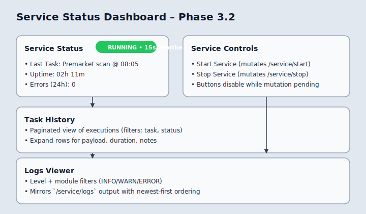

# Service Status & Trading Configuration UI Guide

**Version**: 1.0
**Last Updated**: 2025-11-17
**Status**: ✅ Phase 3 UI shipped (Service Mgmt + Trading Config)

---

## Overview

Phase 3 introduces two high-visibility dashboards in the Modular Trade Agent web app:

1. **Service Status Dashboard** – live view of the per-user trading service, with controls, task history, and recent logs.
2. **Trading Configuration Workspace** – full-fidelity editor for every user-scoped strategy parameter, including presets and deltas vs defaults.

This document explains how to access the pages, what each widget does, the supporting APIs/tests, and how to demo the flow for stakeholders.

---

## Access & Navigation

| Flow | Path | Description |
| --- | --- | --- |
| Main layout | `web/src/routes/AppShell.tsx` | Adds “Service Status” + “Trading Config” links to the sidebar. |
| Service Status UI | `/dashboard/service` | Loads `ServiceStatusPage.tsx` with React Query auto-refresh. |
| Trading Config UI | `/dashboard/config` | Loads `TradingConfigPage.tsx` with TanStack Query + mutations. |

**Auth requirement**: Both routes are nested under the authenticated dashboard router. Users must be logged in; requests automatically include the JWT via the shared API client.

---

## 1. Service Status Dashboard



### Key Widgets

| Component | File | Details |
| --- | --- | --- |
| Status card | `ServiceStatusPage.tsx` | Shows `service_running`, uptime, heartbeat, error count, and last task time. Auto-refreshes every 15s (faster when running). |
| Controls | `ServiceControls.tsx` | Start/Stop buttons with optimistic UI, disabled states, spinner feedback. |
| Task History | `ServiceTasksTable.tsx` | Paginated table of the last 50 executions, filterable by status + task. Rows expand to show payload metadata. |
| Logs Viewer | `ServiceLogsViewer.tsx` | Filter by level/module, shows timestamped log lines with copy-to-clipboard. |

### API Contracts

| Endpoint | Method | Schema |
| --- | --- | --- |
| `/api/v1/user/service/status` | `GET` | Returns `ServiceStatusResponse` (running flag, timestamps, heartbeat, error counts). |
| `/api/v1/user/service/start` | `POST` | Starts or queues the per-user worker. Returns updated status snapshot. |
| `/api/v1/user/service/stop` | `POST` | Gracefully stops the worker and flushes tasks. |
| `/api/v1/user/service/tasks` | `GET` | Returns paginated `ServiceTaskExecution` history + filters. |
| `/api/v1/user/service/logs` | `GET` | Returns recent structured logs with optional level/module filters. |

All endpoints live in `server/app/routers/service.py` with schemas defined under `server/app/schemas/service.py`.

### Usage Flow

1. Navigate to `/dashboard/service`.
2. Observe the status pill (`Running`, `Stopped`, or `Degraded` based on heartbeat drift and error counts).
3. Use **Start Service** whenever the worker is idle. The button shows `Starting…` until the API resolves.
4. Task history auto-refreshes alongside the status poller (shared refetch).
5. Use log filters (level/module) to drill into recent warnings or errors.

### Tests & Monitoring

| Layer | File | Coverage |
| --- | --- | --- |
| API unit tests | `tests/unit/server/test_service_api.py` | 16 tests covering auth, success paths, filters, and error states. |
| React component tests | `web/src/routes/__tests__/ServiceStatusPage.test.tsx` (plus component-specific suites) | Validates loading, auto-refresh, controls, filtering, accessibility labels. |
| Integration tests | `web/src/routes/__tests__/ServiceStatusPage.integration.test.tsx` | Exercises start/stop workflow with mocked API client. |
| E2E demo | `web/tests/e2e/service-status.spec.ts` | Playwright smoke covering navigation, task + log visibility, button states. |

### Demo Checklist

```bash
# Backend: ensure FastAPI server is running (e.g., uvicorn server.app.main:app --reload)
# Frontend: launch Vite dev server
cd web
npm install
npm run dev -- --host 0.0.0.0 --port 4173

# E2E (headless demo)
npm run test:e2e -- service-status.spec.ts
```

> Tip: For live demos without prod data, use the MSW mocks (`npm run dev:mock`) so the dashboard shows deterministic sample tasks/logs.

---

## 2. Trading Configuration Workspace


### Layout

| Section | Component | Highlights |
| --- | --- | --- |
| Presets | `ConfigPresets.tsx` | One-click apply for Conservative/Moderate/Aggressive templates. |
| Strategy Params | `StrategyConfigSection.tsx` | RSI sliders, chart quality toggles, volume caps. Shows default comparisons and validation hints. |
| Capital & Positions | `CapitalConfigSection.tsx` | Capital per trade, max portfolio size with impact banner. |
| Risk | `RiskConfigSection.tsx` | Optional stop-loss tiers, target percentages, risk-reward ratios. |
| Orders | `OrderConfigSection.tsx` | Default exchange/product/order type/variety/validity selectors. |
| Behavior & Advanced | `BehaviorConfigSection.tsx` | Duplicate recommendations, exit rules, news sentiment, ML controls. |

### UX Enhancements

- **Unsaved Changes Detection**: Sticky banner + top-right badge when `localConfig` differs from server baseline.
- **Dual Save Controls**: Primary `Save Changes` near the header plus sticky footer CTA for long forms.
- **Null-safe optional fields**: Inputs render empty string when a server value is `null`; clearing an input sends `null` so optional configs can be unset.
- **Validation hints**: Inline warnings (e.g., “Must be > Tight Stop Loss”) rely on current values, ensuring the user sees constraints before saving.

### API Integration

| Call | Function | Notes |
| --- | --- | --- |
| Fetch | `getTradingConfig()` | Populates the entire page via React Query. |
| Update | `updateTradingConfig(partial)` | Sends only changed keys. The mutation converts `null` → `undefined` where required by the schema. |
| Reset | `resetTradingConfig()` | Restores defaults and clears local modifications. Confirmation dialog protects against accidental resets. |

See `web/src/api/trading-config.ts` for type definitions (`TradingConfig`, `TradingConfigUpdate`, `CONFIG_PRESETS`).

### Presets & Deltas

Each field shows `Default: X` beneath the input. When a value deviates from the default, a yellow badge `*` appears within the label. Presets apply a set of key overrides (strategy, risk, capital) and immediately mark the form as “unsaved” so the user can review before saving.

### Tests & Demos

| Layer | File(s) | Focus |
| --- | --- | --- |
| Component tests | `web/src/routes/__tests__/*ConfigSection*.test.tsx` | Accessibility (labels/ids), validation, onChange handlers. |
| Page unit tests | `web/src/routes/__tests__/TradingConfigPage.test.tsx` | Unsaved indicator, save/reset workflow, preset application. |
| Integration tests | `web/src/routes/__tests__/TradingConfigPage.integration.test.tsx` | End-to-end state transitions with mocked API client. |
| E2E | `web/tests/e2e/trading-config.spec.ts` | User navigates to config page, edits values, saves, resets. |

**Manual demo steps**:

```bash
# Start backend (FastAPI)
uvicorn server.app.main:app --reload

# Run frontend with mock data for deterministic demos
cd web
npm run dev:mock
# Visit http://localhost:4173/dashboard/config
```

During demos, highlight:
1. Applying the Conservative preset (notice capital + risk tiles update).
2. Editing RSI thresholds and watching contextual warnings.
3. Sticky footer “Cancel / Save Changes” CTA when scrolled to lower sections.

---

## 3. Documentation & Hand-offs

- This guide is linked from `documents/getting-started/GETTING_STARTED.md#dashboard-access`.
- Update release notes referencing “Phase 3 UI” should point here for screenshots and API/testing context.
- When adding new UI sections, append them to the tables above and update the SVG mockups in `documents/features/media/`.

---

## 4. Known Limitations & Next Steps

| Area | Status | Planned Follow-up |
| --- | --- | --- |
| Real-time log streaming | ❌ Pending | WebSocket endpoint (`/user/logs/stream`) still TODO in Phase 3.5. |
| Multi-user admin view | ❌ Not yet implemented | Current UI is scoped per user; admin dashboards will be introduced alongside Phase 3.4. |
| Config diff history | 🚧 Planned | Only current vs default is shown; historical snapshots will be tackled when audit trail UI is ready. |

---

## 5. Change Log

| Date | Change | Author |
| --- | --- | --- |
| 2025-11-17 | Initial guide covering Service Status + Trading Config UI, plus demo instructions and mock screenshots. | GPT-5.1 Codex |
