# Trading System Workflow Diagram

## Complete Trading Flow: Analysis → Buy → Retry → Sell → Close

```mermaid
flowchart TD
    Start([System Start]) --> Analysis[📊 Analysis Task<br/>4:00 PM]
    
    Analysis --> AnalysisCheck{Analysis<br/>Successful?}
    AnalysisCheck -->|No| AnalysisFail[❌ Log Error<br/>Skip Buy Orders]
    AnalysisCheck -->|Yes| AnalysisComplete[✅ Generate Recommendations<br/>CSV with buy/strong_buy]
    
    AnalysisComplete --> BuyOrders[🛒 Buy Orders Task<br/>4:05 PM]
    
    BuyOrders --> RetryQueue{Retry Queue<br/>Has Failed Orders?}
    
    RetryQueue -->|Yes| RetryStep[🔄 Retry Failed Orders<br/>Check Balance & Portfolio Limit]
    RetryStep --> RetryCheck{Balance<br/>Sufficient?}
    RetryCheck -->|No| RetryUpdate[Update Retry Count<br/>Keep in Queue]
    RetryCheck -->|Yes| RetryPlace[Place AMO Order<br/>Remove from Queue]
    
    RetryQueue -->|No| NewOrders[📋 Process New Recommendations]
    RetryUpdate --> NewOrders
    
    NewOrders --> PortfolioCheck{Portfolio<br/>Limit Reached?}
    PortfolioCheck -->|Yes| SkipPortfolio[⏭️ Skip Order<br/>Log Reason]
    PortfolioCheck -->|No| DuplicateCheck{Already in<br/>Holdings?}
    
    DuplicateCheck -->|Yes| SkipDuplicate[⏭️ Skip Order<br/>Already Owned]
    DuplicateCheck -->|No| BalanceCheck{Balance<br/>Sufficient?}
    
    BalanceCheck -->|No| SaveRetry[💾 Save to Retry Queue<br/>Send Telegram Notification]
    BalanceCheck -->|Yes| PlaceOrder[📤 Place AMO Buy Order<br/>Get nOrdNo from Broker]
    
    RetryPlace --> PlaceOrder
    PlaceOrder --> SyncStatus[🔄 Immediate Status Sync<br/>Fetch Order Status from Broker]
    
    SyncStatus --> StatusCheck{Order<br/>Status?}
    StatusCheck -->|Rejected| MarkRejected[❌ Mark as REJECTED<br/>Update DB]
    StatusCheck -->|Cancelled| MarkCancelled[🚫 Mark as CANCELLED<br/>Update DB]
    StatusCheck -->|Executed| MarkExecuted[✅ Mark as EXECUTED<br/>Update DB]
    StatusCheck -->|Pending| MarkPending[⏳ Mark as PENDING_EXECUTION<br/>Update DB]
    
    MarkRejected --> EndBuyCycle[End Buy Cycle]
    MarkCancelled --> EndBuyCycle
    MarkExecuted --> EndBuyCycle
    MarkPending --> EndBuyCycle
    SkipPortfolio --> EndBuyCycle
    SkipDuplicate --> EndBuyCycle
    SaveRetry --> EndBuyCycle
    AnalysisFail --> EndBuyCycle
    
    EndBuyCycle --> WaitMarket[⏰ Wait for Market Open<br/>9:15 AM Next Day]
    
    WaitMarket --> PremarketRetry[🔄 Pre-market Retry Task<br/>8:00 AM]
    PremarketRetry --> RetryQueue
    
    WaitMarket --> MarketOpen[🏪 Market Opens<br/>9:15 AM]
    
    MarketOpen --> BuyExecution{AMO Orders<br/>Execute?}
    BuyExecution -->|Yes| PositionCreated[📈 Position Created<br/>Status: ONGOING]
    BuyExecution -->|No| BuyPending[⏳ Order Still Pending<br/>Continue Monitoring]
    
    PositionCreated --> SellMonitor[📉 Sell Monitor Task<br/>9:15 AM - Continuous]
    BuyPending --> SellMonitor
    
    SellMonitor --> PlaceSellOrders[🎯 Place Limit Sell Orders<br/>Target: EMA9 Price]
    
    PlaceSellOrders --> MonitorLoop[🔄 Monitor Loop<br/>Every 60 seconds]
    
    MonitorLoop --> CheckEMA9[📊 Check Current EMA9<br/>Update Sell Order Price]
    
    CheckEMA9 --> EMA9Lower{EMA9<br/>Dropped?}
    EMA9Lower -->|Yes| UpdateSellPrice[📉 Lower Sell Price<br/>Never Raise]
    EMA9Lower -->|No| CheckExecution{Order<br/>Executed?}
    
    UpdateSellPrice --> CheckExecution
    
    CheckExecution -->|No| MonitorLoop
    CheckExecution -->|Yes| SellExecuted[✅ Sell Order Executed<br/>Position Closed]
    
    SellExecuted --> UpdateHistory[📝 Update Trade History<br/>Calculate P&L]
    
    UpdateHistory --> RemoveTracking[🗑️ Remove from Tracking<br/>Mark Position Closed]
    
    RemoveTracking --> MonitorLoop
    
    MonitorLoop --> MarketClose{Market<br/>Closed?}
    MarketClose -->|No| MonitorLoop
    MarketClose -->|Yes| EODCleanup[🧹 EOD Cleanup<br/>6:00 PM]
    
    EODCleanup --> CleanupActions[Clean Expired Retries<br/>Archive Old Orders<br/>Update Statistics]
    
    CleanupActions --> NextDay[🌅 Next Trading Day]
    NextDay --> Analysis
    
    style Analysis fill:#e1f5ff
    style BuyOrders fill:#fff4e1
    style RetryStep fill:#ffe1f5
    style PlaceOrder fill:#e1ffe1
    style SyncStatus fill:#f5e1ff
    style SellMonitor fill:#ffe1e1
    style SellExecuted fill:#e1ffe1
    style MarkRejected fill:#ffcccc
    style MarkCancelled fill:#ffcccc
    style MarkExecuted fill:#ccffcc
```



## Key Decision Points

### 1. **Analysis Phase (4:00 PM)**
- Runs technical analysis on market data
- Generates recommendations CSV with `buy`/`strong_buy` verdicts
- Filters by RSI < 30, price > EMA200, clean chart, near monthly support

### 2. **Buy Orders Phase (4:05 PM)**
- **Step 1**: Retry previously failed orders (if any)
- **Step 2**: Process new recommendations
- **Checks**:
  - Portfolio limit (max 6 positions)
  - Duplicate prevention (already in holdings)
  - Balance sufficiency
- **Actions**:
  - Place AMO order → Get `nOrdNo` from broker
  - **Immediate status sync** → Fetch status and update DB
  - Save to retry queue if balance insufficient

### 3. **Pre-market Retry (8:00 AM)**
- Retries failed orders from previous day
- Valid until 9:15 AM (market open)
- Checks fresh balance and market indicators

### 4. **Market Open (9:15 AM)**
- AMO orders execute automatically
- Positions created with status `ONGOING`
- Sell monitor starts

### 5. **Sell Monitoring (Continuous)**
- Places limit sell orders at EMA9 target
- Monitors every 60 seconds
- Updates sell price if EMA9 drops (never raises)
- Tracks execution and closes positions

### 6. **Position Closing**
- Sell order executes → Position marked closed
- Trade history updated with P&L
- Removed from active tracking

## Status Flow

```
AMO → PENDING_EXECUTION → ONGOING → (Sell Order) → CLOSED
                              ↓
                          REJECTED (if buy fails)
                              ↓
                          CANCELLED (if cancelled)
```

## Database Updates

- **Order Placement**: Creates order with `AMO` status
- **Immediate Sync**: Updates to `PENDING_EXECUTION`, `REJECTED`, `CANCELLED`, or `EXECUTED`
- **Market Open**: Updates to `ONGOING` when buy executes
- **Sell Execution**: Updates to `CLOSED` when position exits

## Retry Logic

- **Same-Day Retry**: Failed orders retried on same day (until 9:15 AM next day)
- **Retry Conditions**:
  - Balance now sufficient
  - Portfolio limit not reached
  - Not already in holdings
  - Fresh market indicators still valid
- **Auto-Expiry**: Orders expire at end of day (technical signals lose validity)

