# Trading System - Simple Workflow

## Simple Flowchart

```mermaid
flowchart TD
    A[📊 Analysis<br/>4:00 PM] --> B[🛒 Buy Orders<br/>4:05 PM]
    
    B --> C{Retry Queue<br/>Empty?}
    C -->|No| D[🔄 Retry Failed Orders]
    C -->|Yes| E[📋 New Recommendations]
    D --> E
    
    E --> F{Portfolio Limit<br/>& Balance OK?}
    F -->|No| G[💾 Save to Retry Queue]
    F -->|Yes| H[📤 Place AMO Order]
    
    G --> I[⏰ Wait for Market Open]
    H --> J[🔄 Sync Status from Broker]
    
    J --> K{Status?}
    K -->|Rejected| L[❌ REJECTED]
    K -->|Pending| M[⏳ PENDING_EXECUTION]
    K -->|Executed| N[✅ ONGOING]
    
    L --> I
    M --> I
    N --> I
    
    I --> O[🔄 Pre-market Retry<br/>8:00 AM]
    O --> C
    
    I --> P[🏪 Market Opens<br/>9:15 AM]
    P --> Q[✅ Buy Orders Execute]
    Q --> R[📈 Position: ONGOING]
    
    R --> S[📉 Sell Monitor<br/>Continuous]
    S --> T[🎯 Place Sell at EMA9]
    T --> U[🔄 Monitor Every 60s]
    
    U --> V{EMA9<br/>Dropped?}
    V -->|Yes| W[📉 Lower Sell Price]
    V -->|No| X{Order<br/>Executed?}
    W --> X
    
    X -->|No| U
    X -->|Yes| Y[✅ Position CLOSED]
    
    Y --> Z[📝 Update History & P&L]
    Z --> AA{More<br/>Positions?}
    AA -->|Yes| U
    AA -->|No| BB[🧹 EOD Cleanup<br/>6:00 PM]
    
    BB --> CC[🌅 Next Day]
    CC --> A
    
    style A fill:#e1f5ff
    style B fill:#fff4e1
    style D fill:#ffe1f5
    style H fill:#e1ffe1
    style J fill:#f5e1ff
    style S fill:#ffe1e1
    style Y fill:#ccffcc
    style L fill:#ffcccc
```



## Simplified Steps

### 1. **Analysis (4:00 PM)**
   - Analyze market data
   - Generate buy recommendations

### 2. **Buy Orders (4:05 PM)**
   - Retry failed orders first
   - Process new recommendations
   - Check portfolio limit & balance
   - Place AMO orders
   - **Sync status immediately** from broker

### 3. **Pre-market Retry (8:00 AM)**
   - Retry failed orders before market opens

### 4. **Market Open (9:15 AM)**
   - AMO orders execute
   - Positions become ONGOING

### 5. **Sell Monitoring (Continuous)**
   - Place sell orders at EMA9
   - Monitor every 60 seconds
   - Update price if EMA9 drops
   - Close position when executed

### 6. **End of Day (6:00 PM)**
   - Cleanup expired retries
   - Archive old orders

## Order Status Flow

```
AMO → PENDING_EXECUTION → ONGOING → CLOSED
         ↓                    ↓
      REJECTED          (Sell Order)
      CANCELLED
```

